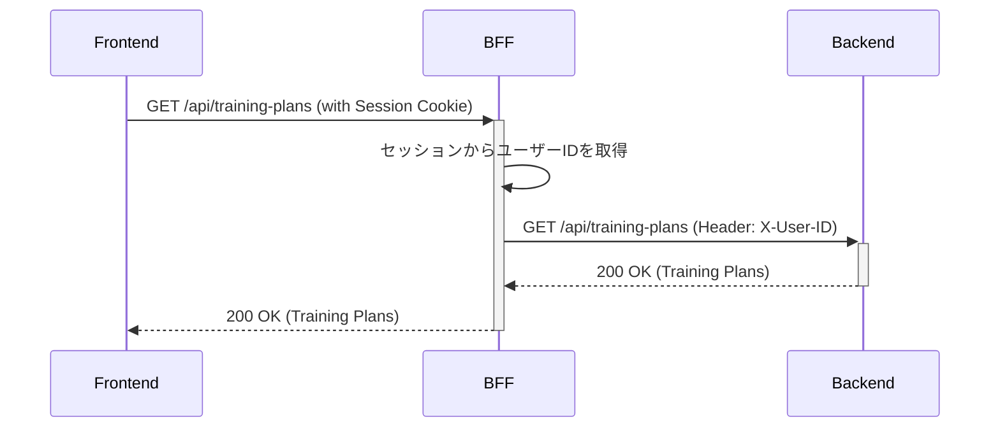
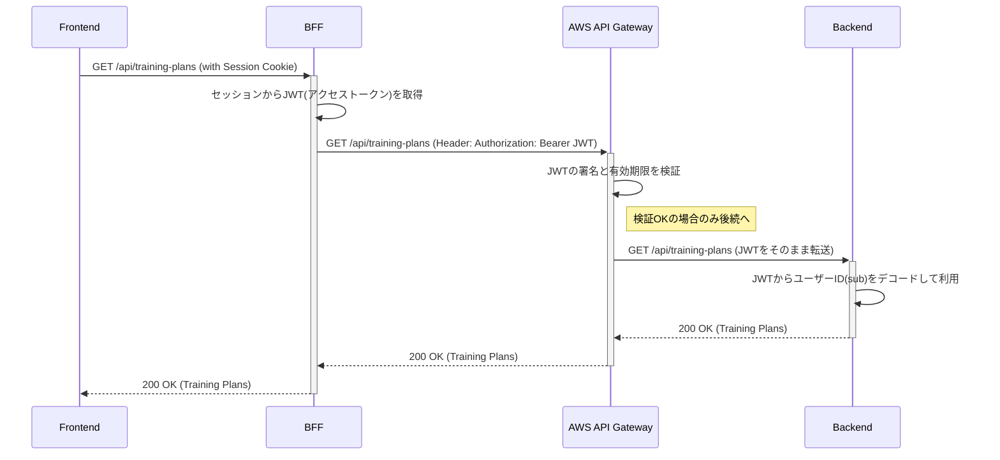

# CLAUDE.md

このファイルは、このリポジトリのコードで作業する際にClaude Code (claude.ai/code) にガイダンスを提供します。

## アーキテクチャ概要

このプロジェクトは、KeyCloak認証を使用したBFF (Backend for Frontend) パターンを実装しています：

- **Frontend (port 3000)**: Next.js + TypeScript + TailwindCSS
- **BFF (port 8080)**: SpringBoot + OAuth2 Client + API Gateway  
- **Backend (port 8081)**: SpringBoot + JPA + H2 Database
- **Auth (port 8180)**: KeyCloak (Docker)

## 開発コマンド

### 全体の起動順序
1. `docker-compose up -d` - KeyCloak起動
2. `cd backend && ./mvnw spring-boot:run` - Backend起動
3. `cd bff && ./mvnw spring-boot:run` - BFF起動  
4. `cd frontend && npm run dev` - Frontend起動

### Frontend (Next.js)
```bash
cd frontend
npm run dev      # 開発サーバー起動
npm run build    # プロダクションビルド
npm run lint     # ESLint実行
npm run start    # プロダクションサーバー起動
```

### Backend & BFF (SpringBoot)
```bash
cd backend  # または cd bff
./mvnw spring-boot:run    # アプリケーション起動
./mvnw test              # テスト実行
./mvnw clean install     # ビルド
```

## 認証フローとアーキテクチャ

### 現状のアーキテクチャ (開発環境)

現状はBFFがAPI Gatewayの役割を兼務し、バックエンドへのリクエスト時にカスタムヘッダーでユーザー情報を連携する、信頼ベースのシンプルな構成です。

- **認証フロー**:
    1. ユーザーがFrontendの保護されたページにアクセス
    2. BFFが認証状態をチェック（セッションベース）
    3. 未認証の場合、KeyCloakにリダイレクト
    4. 認証後、BFFがセッションを確立
    5. BFFがBackendAPIを呼び出し時に`X-User-ID`ヘッダーを付与

- **シーケンス図**:


---

### 今後の課題: 本番構成への移行 (AWS API Gateway)

本番環境では、セキュリティとスケーラビリティを向上させるため、AWS API GatewayをBFFとバックエンドの間に配置します。これにより、JWTを利用した検証ベースの堅牢なアーキテクチャに移行します。

- **主な変更点**:
    - BFFはバックエンドを直接呼び出す代わりに、AWS API Gatewayのエンドポイントを呼び出します。
    - BFFは`X-User-ID`ヘッダーの代わりに、Keycloakから取得したJWT（アクセストークン）を`Authorization: Bearer`ヘッダーに含めて送信します。
    - AWS API Gatewayは、JWTオーソライザー機能を用いて、リクエストがバックエンドに到達する前にJWTの署名と有効期限を検証します。
    - バックエンドは、API Gatewayによって検証済みのJWTを受け取り、そこからユーザー情報（`sub`クレーム）を読み取って処理を行います。

- **シーケンス図**:


- **補足: BFFのスケールアウト対応**

    加えて、BFFのスケールアウトに対応するため、セッション管理の外部化も重要な課題です。現状のインメモリセッションでは、BFFのインスタンス間でセッションが共有されません。本番構成では、Spring Sessionライブラリなどを利用して、セッション情報を外部のデータストア（例: AWS ElastiCache for Redis）で一元管理し、BFFをステートレスに近い状態で運用できるようにすることが推奨されます。

---

## 重要な設定

### KeyCloak設定
- Realm: `training-app`
- Client ID: `training-app`
- Port: 8180
- Admin: admin/admin

### API通信
- Frontend → BFF: `credentials: 'include'`でクッキー認証
- BFF → Backend: `X-User-ID`ヘッダーでユーザー識別

### データベース
- H2インメモリDB（開発用）
- コンソール: http://localhost:8081/h2-console
- 自動テーブル作成（create-drop）

## トラブルシューティング

### 認証エラー時
1. KeyCloakが起動しているか確認
2. BFFのapplication.ymlでclient-secretが正しいか確認
3. サーバー再起動でセッション/キャッシュクリア

### API通信エラー時
1. BFFが認証済みユーザーに`X-User-ID`を設定しているか確認
2. CORSの設定を確認
3. 各サービスの起動順序を確認

## コードスタイル

- フロントエンド: インラインスタイル（サイバー風デザイン）
- バックエンド: 標準的なSpringBoot構成
- 日本語コメント推奨（開発チームの要求）