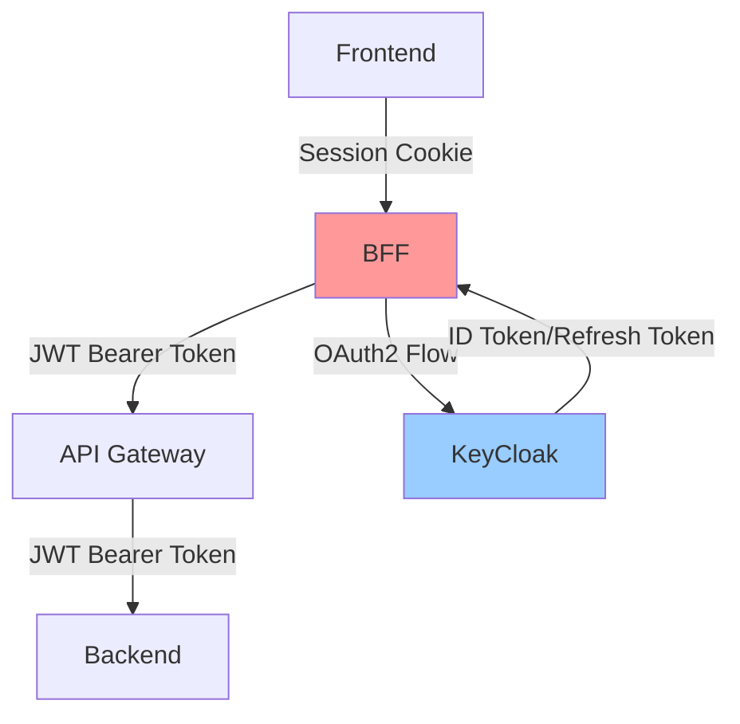
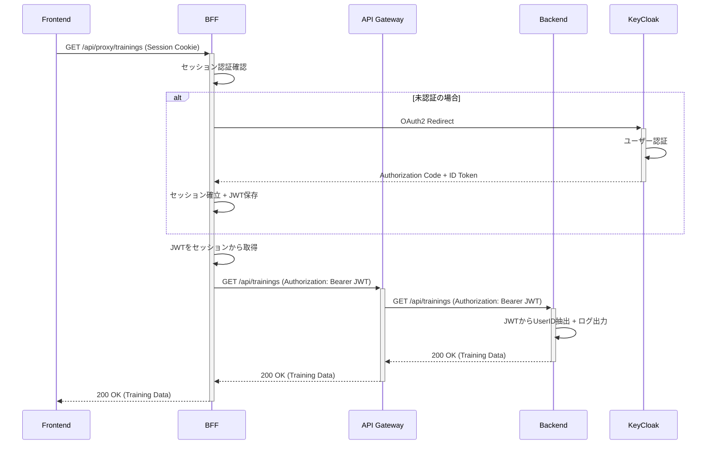
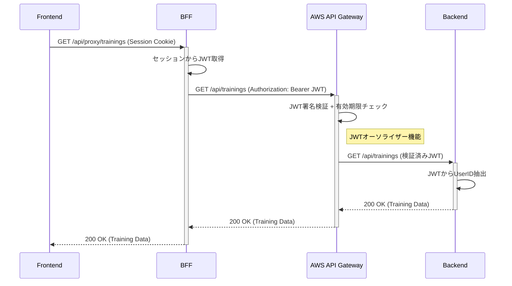

# CLAUDE.md

このファイルは、このリポジトリのコードで作業する際にClaude Code (claude.ai/code) にガイダンスを提供します。

## プロジェクト概要

このプロジェクトは、**セキュアなBFFパターンを使用したマイクロサービスアーキテクチャ**を実装しています。  
将来的なAWS API Gateway移行を見据えた構成で、JWTを安全に管理する設計です。

### アーキテクチャ構成

```
Frontend (3000) ←→ BFF (8080) ←→ API Gateway (8082) ←→ Backend (8081)
                        ↑                ↑
                 セッション管理      JWT認証/プロキシ
                   ↓
               KeyCloak (8180)
```

- **Frontend (port 3000)**: Next.js + TypeScript + TailwindCSS
- **BFF (port 8080)**: SpringBoot + OAuth2 Client (認証 + セキュリティプロキシ)
- **API Gateway (port 8082)**: SpringBoot + WebFlux (独立したゲートウェイサービス)
- **Backend (port 8081)**: SpringBoot + JPA + H2 Database
- **Auth (port 8180)**: KeyCloak (Docker)

## BFFの設計思想と価値

### BFFが解決する重要な課題

1. **JWTセキュリティ**: JWTをフロントエンドに露出させない
2. **認証境界**: セッションベースの安全な認証管理
3. **セキュリティプロキシ**: サーバーサイドでのトークン変換
4. **将来拡張性**: AWS API Gateway移行への準備

### セキュリティアーキテクチャの核心



**重要**: フロントエンドにはJWTを一切露出させず、セッションCookieのみで通信

## 開発コマンド

### 全体の起動順序
```bash
# 1. 認証サーバー起動
docker-compose up -d

# 2. バックエンドサービス起動  
cd backend && ./mvnw spring-boot:run

# 3. API Gateway起動
cd api-gateway && ./mvnw spring-boot:run

# 4. BFF起動
cd bff && ./mvnw spring-boot:run

# 5. フロントエンド起動
cd frontend && npm run dev
```

### 個別サービス管理

#### Frontend (Next.js)
```bash
cd frontend
npm run dev      # 開発サーバー起動
npm run build    # プロダクションビルド
npm run lint     # ESLint実行
npm run start    # プロダクションサーバー起動
```

#### Backend Services (SpringBoot)
```bash
cd [backend|api-gateway|bff]
./mvnw spring-boot:run    # アプリケーション起動
./mvnw test              # テスト実行
./mvnw clean install     # ビルド
```

#### KeyCloak (Docker)
```bash
docker-compose up -d     # バックグラウンド起動
docker-compose down      # 停止
docker-compose logs keycloak  # ログ確認
```

## 認証フローの詳細

### 現在の実装 (開発環境)

**セキュアセッション + JWT変換**方式で実装されています：



### BFFの汎用プロキシ実装

**重複排除**: 個別エンドポイントを削除し、汎用プロキシで対応

```java
@RequestMapping("/api/proxy/**")
public ResponseEntity<?> proxyRequest(
    @AuthenticationPrincipal OidcUser principal,
    HttpServletRequest request,
    @RequestBody(required = false) Object body) {
    
    // 1. 認証チェック
    // 2. JWT取得（サーバーサイド）
    // 3. API Gateway向けプロキシ処理
    // 4. Authorizationヘッダー付与
}
```

## 将来の本番構成 (AWS移行)

本番環境では、現在の独立したAPI GatewayをAWS API Gatewayに置き換えます：



**主な変更点**:
- 現在の独立API Gateway → AWS API Gateway
- JWT検証がAWSで自動化
- BFFの変更は最小限（エンドポイントURL変更のみ）

## セキュリティベストプラクティス

### 実装済みセキュリティ対策

1. **JWT隠蔽**: JWTをフロントエンドに露出させない
2. **セッション管理**: HttpOnly Cookie + SameSite=Lax
3. **認証境界**: BFFが唯一の認証エントリーポイント
4. **トークン変換**: Session ↔ JWT変換をサーバーサイドで実行

### 本番環境での追加対策

1. **セッション外部化**: Redis/ElastiCacheでセッション共有
2. **JWT検証強化**: AWS API GatewayのJWTオーソライザー
3. **HTTPS強制**: 全通信のTLS化
4. **CORS厳格化**: Origin制限の強化

## 重要な設定

### KeyCloak設定
- **Realm**: `training-app`
- **Client ID**: `training-app`
- **Client Secret**: (application.ymlに記載)
- **Port**: 8180
- **Admin**: admin/admin

### API通信設定
- **Frontend → BFF**: セッションCookie (credentials: 'include')
- **BFF → API Gateway**: JWT Bearer Token
- **API Gateway → Backend**: JWT Bearer Token (透過)

### データベース設定
- **Type**: H2インメモリDB（開発用）
- **Console**: http://localhost:8081/h2-console
- **Schema**: 自動生成（create-drop）

## API設計

### BFF API エンドポイント

#### 認証API
- `GET /api/auth/status` - 認証状態確認
- `GET /api/auth/login` - ログイン開始
- `GET /api/auth/logout` - ログアウト処理

#### 汎用プロキシAPI
- `* /api/proxy/**` - 全データAPIの汎用プロキシ
- 例: `GET /api/proxy/trainings` → `GET /api/trainings` (API Gateway)

### API Gateway エンドポイント
- `GET /api/trainings` - トレーニング一覧
- `POST /api/trainings` - トレーニング作成
- `GET /api/trainings/{id}` - トレーニング詳細
- `PUT /api/trainings/{id}` - トレーニング更新
- `DELETE /api/trainings/{id}` - トレーニング削除
- `GET /api/trainings/types` - タイプ一覧
- `GET /api/trainings/difficulties` - 難易度一覧

## トラブルシューティング

### 認証エラー時
1. KeyCloakコンテナが起動しているか確認: `docker ps`
2. BFFのclient-secretが正しいか確認: `application.yml`
3. セッション/キャッシュクリア: サーバー再起動

### API通信エラー時
1. サービス起動順序の確認（KeyCloak → Backend → API Gateway → BFF → Frontend）
2. JWT取得/変換の確認: BFFログをチェック
3. CORS設定の確認: ブラウザDevToolsのNetwork tab

### JWT関連エラー時
1. JWTの有効期限確認: KeyCloak Admin Console
2. JWT形式の確認: デバッガーでトークン検証
3. クレーム情報の確認: Backendのログ出力

## 開発時の注意事項

### セキュリティ原則
- **絶対にJWTをフロントエンドに送信しない**
- セッションCookieでの認証を維持
- サーバーサイドでのトークン管理を徹底

### コード規約
- 日本語コメント推奨（チーム要求）
- SpringBoot標準構成に準拠
- RESTful API設計原則の遵守

### 将来拡張への配慮
- AWS移行を考慮した疎結合設計
- 環境別設定の外部化
- マイクロサービス間の独立性確保