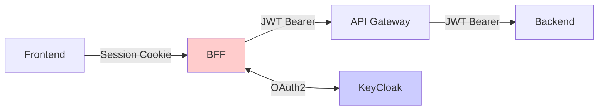

# BFF Study Project

セキュアなBFF (Backend for Frontend) パターンを使用したマイクロサービスアーキテクチャの学習プロジェクトです。  
JWTを安全に管理し、将来的なAWS API Gateway移行を見据えた設計を実装しています。

## 🏗 アーキテクチャ

```
Frontend (3000) ←→ BFF (8080) ←→ API Gateway (8082) ←→ Backend (8081)
                        ↑                ↑
                 セッション管理      JWT認証/プロキシ
                   ↓
               KeyCloak (8180)
```

### 各サービスの役割

- **Frontend**: Next.js製のSPA、セッションCookieでBFFと通信
- **BFF**: 認証管理 + セキュリティプロキシ、JWTをサーバーサイドで管理
- **API Gateway**: 独立したゲートウェイサービス、JWT認証を処理
- **Backend**: ビジネスロジック + データ永続化
- **KeyCloak**: OAuth2/OpenID Connect認証プロバイダー

## 🔒 セキュリティ設計

### 重要な設計原則

1. **JWTをフロントエンドに露出させない**
2. **セッションベースの安全な認証**
3. **サーバーサイドでのトークン変換**



## 🚀 クイックスタート

### 前提条件

- Java 17+
- Node.js 18+
- Docker & Docker Compose
- Maven 3.8+

### 起動手順

1. **認証サーバー起動**
   ```bash
   docker-compose up -d
   ```

2. **バックエンドサービス起動**
   ```bash
   cd backend
   ./mvnw spring-boot:run
   ```

3. **API Gateway起動**
   ```bash
   cd api-gateway
   ./mvnw spring-boot:run
   ```

4. **BFF起動**
   ```bash
   cd bff
   ./mvnw spring-boot:run
   ```

5. **フロントエンド起動**
   ```bash
   cd frontend
   npm install
   npm run dev
   ```

### アクセス確認

- **アプリケーション**: http://localhost:3000
- **KeyCloak Admin**: http://localhost:8180/admin (admin/admin)
- **Backend API Doc**: http://localhost:8081/swagger-ui.html
- **H2 Console**: http://localhost:8081/h2-console

## 📋 使用技術

### Frontend
- **Next.js 14** - React フレームワーク
- **TypeScript** - 型安全性
- **TailwindCSS** - スタイリング

### Backend Services
- **Spring Boot 3.5** - アプリケーションフレームワーク
- **Spring Security** - 認証・認可
- **Spring Data JPA** - データアクセス
- **H2 Database** - インメモリDB（開発用）

### Infrastructure
- **KeyCloak** - OAuth2/OIDC認証プロバイダー
- **Docker** - コンテナ化
- **Maven** - ビルドツール

## 🔧 開発時の操作

### サービス管理

```bash
# 全サービス停止
docker-compose down

# KeyCloakログ確認
docker-compose logs keycloak

# 個別サービス再起動
cd [service-name]
./mvnw spring-boot:run
```

### テスト実行

```bash
# バックエンドテスト
cd backend && ./mvnw test

# フロントエンドテスト
cd frontend && npm run test

# リント実行
cd frontend && npm run lint
```

### ビルド

```bash
# バックエンドビルド
cd [backend|api-gateway|bff]
./mvnw clean install

# フロントエンドビルド
cd frontend
npm run build
```

## 📖 API エンドポイント

### BFF (port 8080)

#### 認証API
- `GET /api/auth/status` - 認証状態確認
- `GET /api/auth/login` - ログイン開始
- `GET /api/auth/logout` - ログアウト処理

#### 汎用プロキシAPI
- `* /api/proxy/**` - 全データAPIの汎用プロキシ
- 例: `GET /api/proxy/trainings` → API Gatewayの`/api/trainings`に転送

### API Gateway (port 8082)
- `GET /api/trainings` - トレーニング一覧
- `POST /api/trainings` - トレーニング作成
- `GET /api/trainings/{id}` - トレーニング詳細
- `PUT /api/trainings/{id}` - トレーニング更新
- `DELETE /api/trainings/{id}` - トレーニング削除

## 🐛 トラブルシューティング

### 認証エラー

```bash
# KeyCloakの状態確認
docker ps | grep keycloak

# BFF設定確認
cat bff/src/main/resources/application.yml
```

### API通信エラー

1. **起動順序の確認**: KeyCloak → Backend → API Gateway → BFF → Frontend
2. **ポート使用状況**: `lsof -i :8080,8081,8082,8180,3000`
3. **ログ確認**: 各サービスのコンソール出力をチェック

### JWT関連エラー

```bash
# Backend側でJWT解析ログ確認
cd backend && ./mvnw spring-boot:run

# KeyCloak Admin Consoleでトークン確認
open http://localhost:8180/admin
```

## 🔮 将来の拡張計画

### AWS移行

現在の独立API Gateway → AWS API Gatewayへの移行を想定:

1. **JWT検証**: AWS API GatewayのJWTオーソライザー使用
2. **スケーリング**: Auto Scaling Group + Load Balancer
3. **セッション外部化**: ElastiCache for Redis

### セキュリティ強化

1. **HTTPS化**: 全通信のTLS化
2. **CORS厳格化**: Origin制限の強化
3. **レート制限**: API呼び出し頻度制限

## 📚 学習リソース

- [Spring Security Reference](https://docs.spring.io/spring-security/reference/)
- [KeyCloak Documentation](https://www.keycloak.org/documentation)
- [OAuth 2.0 RFC](https://tools.ietf.org/html/rfc6749)
- [JWT.io](https://jwt.io/) - JWT デバッガー

## 🤝 開発ガイドライン

詳細な開発ガイドライン、アーキテクチャの設計思想、セキュリティ原則については [CLAUDE.md](./CLAUDE.md) を参照してください。

## 📄 ライセンス

This project is licensed under the MIT License.